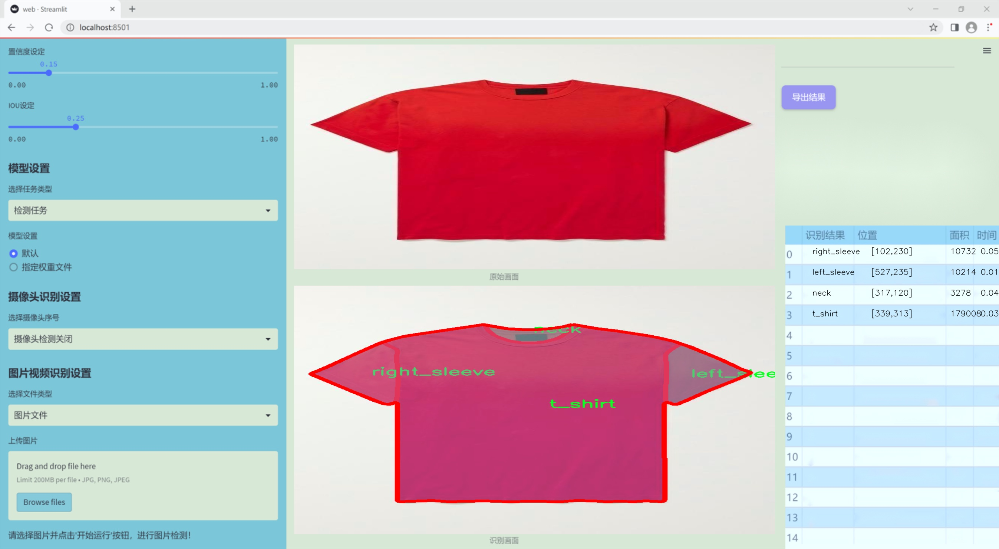
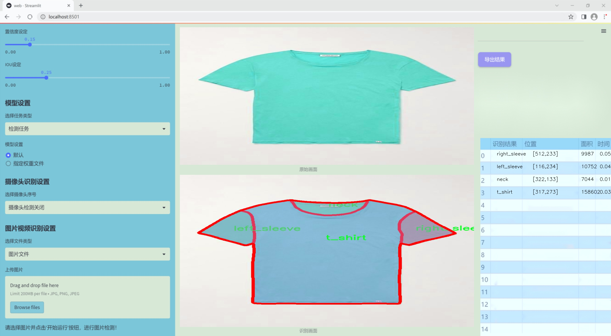
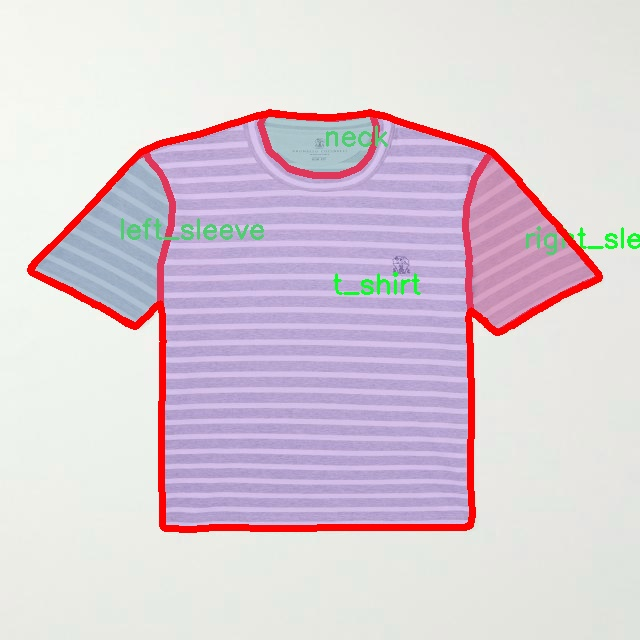
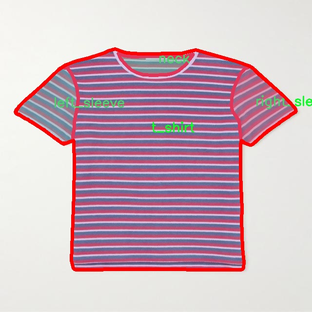
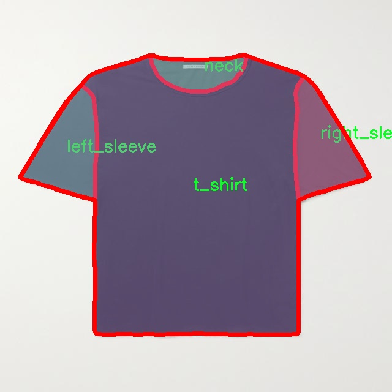
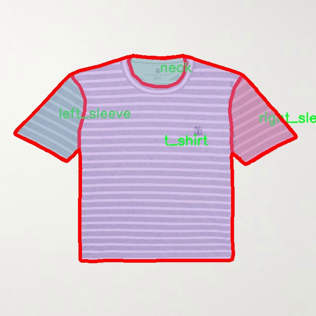
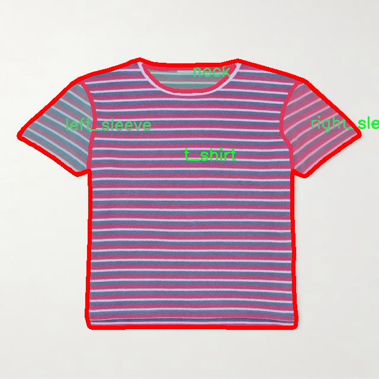

### 1.背景意义

研究背景与意义

随着全球服装产业的快速发展，产品质量的保障已成为企业竞争力的重要组成部分。服装缺陷检测作为质量控制的关键环节，直接影响到消费者的购买体验和品牌形象。传统的人工检测方法不仅效率低下，而且容易受到人为因素的影响，导致漏检和误判的情况频繁发生。因此，基于计算机视觉的自动化检测系统应运而生，成为提升服装生产效率和质量的重要工具。

近年来，深度学习技术的飞速发展为图像识别和物体检测提供了新的解决方案。其中，YOLO（You Only Look Once）系列模型因其高效的实时检测能力和较高的准确率，逐渐成为服装缺陷检测领域的研究热点。YOLOv11作为该系列的最新版本，进一步提升了检测精度和速度，适用于复杂场景下的缺陷识别。然而，现有的YOLOv11模型在特定应用场景下仍存在一定的局限性，尤其是在服装缺陷的多样性和复杂性方面。

本研究旨在基于改进的YOLOv11模型，构建一个高效的服装缺陷检测系统。我们将使用一个包含1600张图像的数据集，涵盖了七种缺陷类别，包括额外缝线、左袖、领口、裤子、右袖、缝合线和T恤等。这些类别的多样性为模型的训练和评估提供了丰富的样本，有助于提高模型的泛化能力和实用性。通过对数据集的深入分析和模型的优化调整，我们期望能够显著提升检测的准确率和效率，为服装行业的智能化转型提供有力支持。

综上所述，基于改进YOLOv11的服装缺陷检测系统不仅能够提升生产效率，降低人工成本，还能有效提高产品质量，满足消费者日益增长的需求。这一研究不仅具有重要的理论意义，也为实际应用提供了可行的解决方案，推动了服装行业的技术进步和创新发展。

### 2.视频效果

[2.1 视频效果](https://www.bilibili.com/video/BV1dCkQYXE8B/)

### 3.图片效果






##### [项目涉及的源码数据来源链接](https://kdocs.cn/l/cszuIiCKVNis)**

注意：本项目提供训练的数据集和训练教程,由于版本持续更新,暂不提供权重文件（best.pt）,请按照6.训练教程进行训练后实现上图演示的效果。

### 4.数据集信息

##### 4.1 本项目数据集类别数＆类别名

nc: 7
names: ['extra_seam', 'left_sleeve', 'neck', 'pant', 'right_sleeve', 'seam', 't_shirt']


该项目为【图像分割】数据集，请在【训练教程和Web端加载模型教程（第三步）】这一步的时候按照【图像分割】部分的教程来训练

##### 4.2 本项目数据集信息介绍

本项目数据集信息介绍

本项目旨在改进YOLOv11模型，以实现高效的服装缺陷检测系统，特别针对“T-shirt”类服装的质量控制。为此，我们构建了一个专门的数据集，涵盖了与T恤相关的多种缺陷类型，以确保模型能够准确识别和分类不同的缺陷。该数据集共包含七个类别，具体包括：额外缝线（extra_seam）、左袖（left_sleeve）、领口（neck）、裤子（pant）、右袖（right_sleeve）、缝合线（seam）以及T恤本身（t_shirt）。这些类别不仅反映了T恤在生产和使用过程中可能出现的各种缺陷，还考虑到了服装设计的复杂性和多样性。

数据集的构建过程包括从多个来源收集高质量的图像，并对每个图像进行精确标注，以确保模型训练的有效性和准确性。每个类别的样本数量经过精心设计，以避免类别不平衡问题，从而提高模型的泛化能力。数据集中包含的图像涵盖了不同的拍摄角度、光照条件和背景，以模拟实际应用中的各种场景。这种多样性不仅增强了模型的鲁棒性，还提高了其在实际应用中的适应能力。

通过使用该数据集进行训练，YOLOv11模型将能够更好地识别和定位T恤上的各种缺陷，进而为服装生产企业提供高效的质量检测解决方案。我们相信，随着数据集的不断扩展和模型的持续优化，服装缺陷检测的准确性和效率将得到显著提升，为行业的发展贡献积极的力量。











### 5.全套项目环境部署视频教程（零基础手把手教学）

[5.1 所需软件PyCharm和Anaconda安装教程（第一步）](https://www.bilibili.com/video/BV1BoC1YCEKi/?spm_id_from=333.999.0.0&vd_source=bc9aec86d164b67a7004b996143742dc)


[5.2 安装Python虚拟环境创建和依赖库安装视频教程（第二步）](https://www.bilibili.com/video/BV1ZoC1YCEBw?spm_id_from=333.788.videopod.sections&vd_source=bc9aec86d164b67a7004b996143742dc)

### 6.改进YOLOv11训练教程和Web_UI前端加载模型教程（零基础手把手教学）

[6.1 改进YOLOv11训练教程和Web_UI前端加载模型教程（第三步）](https://www.bilibili.com/video/BV1BoC1YCEhR?spm_id_from=333.788.videopod.sections&vd_source=bc9aec86d164b67a7004b996143742dc)


按照上面的训练视频教程链接加载项目提供的数据集，运行train.py即可开始训练



     Epoch   gpu_mem       box       obj       cls    labels  img_size
     1/200     20.8G   0.01576   0.01955  0.007536        22      1280: 100%|██████████| 849/849 [14:42<00:00,  1.04s/it]
               Class     Images     Labels          P          R     mAP@.5 mAP@.5:.95: 100%|██████████| 213/213 [01:14<00:00,  2.87it/s]
                 all       3395      17314      0.994      0.957      0.0957      0.0843

     Epoch   gpu_mem       box       obj       cls    labels  img_size
     2/200     20.8G   0.01578   0.01923  0.007006        22      1280: 100%|██████████| 849/849 [14:44<00:00,  1.04s/it]
               Class     Images     Labels          P          R     mAP@.5 mAP@.5:.95: 100%|██████████| 213/213 [01:12<00:00,  2.95it/s]
                 all       3395      17314      0.996      0.956      0.0957      0.0845

     Epoch   gpu_mem       box       obj       cls    labels  img_size
     3/200     20.8G   0.01561    0.0191  0.006895        27      1280: 100%|██████████| 849/849 [10:56<00:00,  1.29it/s]
               Class     Images     Labels          P          R     mAP@.5 mAP@.5:.95: 100%|███████   | 187/213 [00:52<00:00,  4.04it/s]
                 all       3395      17314      0.996      0.957      0.0957      0.0845


###### [项目数据集下载链接](https://kdocs.cn/l/cszuIiCKVNis)

### 7.原始YOLOv11算法讲解


YOLO11 是 Ultralytics YOLO 系列的最新版本，结合了尖端的准确性、速度和效率，用于目标检测、分割、分类、定向边界框和姿态估计。与
YOLOv8 相比，它具有更少的参数和更好的结果，不难预见，YOLO11 在边缘设备上更高效、更快，将频繁出现在计算机视觉领域的最先进技术（SOTA）中。


**主要特点**

  * **增强的特征提取：**YOLO11 使用改进的主干和颈部架构来增强特征提取，以实现更精确的目标检测和复杂任务的性能。

  * **针对效率和速度优化：**精细的架构设计和优化的训练流程在保持准确性和性能之间最佳平衡的同时，提供更快的处理速度。

  * **更少的参数，更高的准确度：**YOLO11m 在 COCO 数据集上实现了比 YOLOv8m 更高的 mAP，参数减少了 22%，提高了计算效率，同时不牺牲准确度。

  * **跨环境的适应性：**YOLO11 可以无缝部署在边缘设备、云平台和配备 NVIDIA GPU 的系统上，确保最大的灵活性。

  * **支持广泛的任务范围：**YOLO11 支持各种计算机视觉任务，如目标检测、实例分割、图像分类、姿态估计和定向目标检测（OBB）。


### 8.200+种全套改进YOLOV11创新点原理讲解

#### 8.1 200+种全套改进YOLOV11创新点原理讲解大全

由于篇幅限制，每个创新点的具体原理讲解就不全部展开，具体见下列网址中的改进模块对应项目的技术原理博客网址【Blog】（创新点均为模块化搭建，原理适配YOLOv5~YOLOv11等各种版本）

[改进模块技术原理博客【Blog】网址链接](https://gitee.com/qunmasj/good)


#### 8.2 精选部分改进YOLOV11创新点原理讲解

###### 这里节选部分改进创新点展开原理讲解(完整的改进原理见上图和[改进模块技术原理博客链接](https://gitee.com/qunmasj/good)【如果此小节的图加载失败可以通过CSDN或者Github搜索该博客的标题访问原始博客，原始博客图片显示正常】


### HRNet V2简介
现在设计高低分辨率融合的思路主要有以下四种：


（a）对称结构。如U-Net、Hourglass等，都是先下采样再上采样，上下采样过程对称。

（b）级联金字塔。如refinenet等，高低分辨率融合时经过卷积处理。

（c）简单的baseline，用转职卷积进行上采样。

（d）扩张卷积。如deeplab等，增大感受野，减少下采样次数，可以无需跳层连接直接进行上采样。

（b）（c）都是使用复杂一些的网络进行下采样（如resnet、vgg），再用轻量级的网络进行上采样。

HRNet V1是在（b）的基础上进行改进，从头到尾保持大的分辨率表示。然而HRNet V1仅是用在姿态估计领域的，HRNet V2对它做小小的改进可以使其适用于更广的视觉任务。这一改进仅仅增加了较小的计算开销，但却提升了较大的准确度。

#### 网络结构图：


这个结构图简洁明了就不多介绍了，首先图2的输入是已经经过下采样四倍的feature map，横向的conv block指的是basicblock 或 bottleblock，不同分辨率之间的多交叉线部分是multi-resolution convolution（多分辨率组卷积）。

到此为止HRNet V2和HRNet V1是完全一致的。

区别之处在于这个基网络上加的一个head：


图3介绍的是接在图2最后的head。（a）是HRNet V1的头，很明显他只用了大分辨率的特征图。（b）（c）是HRNet V2的创新点，（b）用与语义分割，（c）用于目标检测。除此之外作者还在实验部分介绍了用于分类的head，如图4所示。


#### 多分辨率block：


一个多分辨率block由多分辨率组卷积（a）和多分辨率卷积（b）组成。（c）是一个正常卷积的展开，（b）的灵感来源于（c）。代码中（a）部分由Bottleneck和BasicBlock组成。

多分辨率卷积和正常卷积的区别：（1）多分辨率卷积中，每个通道的subset的分辨率都不一样。（2）通道之间的连接如果是降分辨率，则用的是3x3的2stride的卷积，如果是升分辨率，用的是双线性最邻近插值上采样。


### 9.系统功能展示

图9.1.系统支持检测结果表格显示

  图9.2.系统支持置信度和IOU阈值手动调节

  图9.3.系统支持自定义加载权重文件best.pt(需要你通过步骤5中训练获得)

  图9.4.系统支持摄像头实时识别

  图9.5.系统支持图片识别

  图9.6.系统支持视频识别

  图9.7.系统支持识别结果文件自动保存

  图9.8.系统支持Excel导出检测结果数据


### 10. YOLOv11核心改进源码讲解

#### 10.1 fast_kan_conv.py

以下是代码中最核心的部分，并附上详细的中文注释：

```python
import torch
import torch.nn as nn

class RadialBasisFunction(nn.Module):
    def __init__(self, grid_min: float = -2., grid_max: float = 2., num_grids: int = 8, denominator: float = None):
        super().__init__()
        # 创建一个线性空间的网格
        grid = torch.linspace(grid_min, grid_max, num_grids)
        self.grid = torch.nn.Parameter(grid, requires_grad=False)  # 将网格设置为不可训练的参数
        self.denominator = denominator or (grid_max - grid_min) / (num_grids - 1)  # 计算分母

    def forward(self, x):
        # 计算径向基函数的输出
        return torch.exp(-((x[..., None] - self.grid) / self.denominator) ** 2)

class FastKANConvNDLayer(nn.Module):
    def __init__(self, conv_class, norm_class, input_dim, output_dim, kernel_size, groups=1, padding=0, stride=1, dilation=1, ndim: int = 2, grid_size=8, base_activation=nn.SiLU, grid_range=[-2, 2], dropout=0.0):
        super(FastKANConvNDLayer, self).__init__()
        # 初始化参数
        self.inputdim = input_dim
        self.outdim = output_dim
        self.kernel_size = kernel_size
        self.padding = padding
        self.stride = stride
        self.dilation = dilation
        self.groups = groups
        self.ndim = ndim
        self.grid_size = grid_size
        self.base_activation = base_activation()  # 基础激活函数
        self.grid_range = grid_range

        # 检查输入参数的有效性
        if groups <= 0:
            raise ValueError('groups must be a positive integer')
        if input_dim % groups != 0:
            raise ValueError('input_dim must be divisible by groups')
        if output_dim % groups != 0:
            raise ValueError('output_dim must be divisible by groups')

        # 创建基础卷积层和样条卷积层
        self.base_conv = nn.ModuleList([conv_class(input_dim // groups, output_dim // groups, kernel_size, stride, padding, dilation, groups=1, bias=False) for _ in range(groups)])
        self.spline_conv = nn.ModuleList([conv_class(grid_size * input_dim // groups, output_dim // groups, kernel_size, stride, padding, dilation, groups=1, bias=False) for _ in range(groups)])

        # 创建归一化层
        self.layer_norm = nn.ModuleList([norm_class(output_dim // groups) for _ in range(groups)])

        # 创建径向基函数
        self.rbf = RadialBasisFunction(grid_range[0], grid_range[1], grid_size)

        # 创建dropout层
        self.dropout = None
        if dropout > 0:
            if ndim == 1:
                self.dropout = nn.Dropout1d(p=dropout)
            if ndim == 2:
                self.dropout = nn.Dropout2d(p=dropout)
            if ndim == 3:
                self.dropout = nn.Dropout3d(p=dropout)

        # 使用Kaiming均匀分布初始化卷积层的权重
        for conv_layer in self.base_conv:
            nn.init.kaiming_uniform_(conv_layer.weight, nonlinearity='linear')
        for conv_layer in self.spline_conv:
            nn.init.kaiming_uniform_(conv_layer.weight, nonlinearity='linear')

    def forward_fast_kan(self, x, group_index):
        # 计算基础卷积的输出
        base_output = self.base_conv[group_index](self.base_activation(x))
        if self.dropout is not None:
            x = self.dropout(x)  # 应用dropout
        # 计算样条卷积的输出
        spline_basis = self.rbf(self.layer_norm[group_index](x))
        spline_basis = spline_basis.moveaxis(-1, 2).flatten(1, 2)  # 调整维度以适应卷积层
        spline_output = self.spline_conv[group_index](spline_basis)
        # 返回基础输出和样条输出的和
        return base_output + spline_output

    def forward(self, x):
        # 将输入分割为多个组
        split_x = torch.split(x, self.inputdim // self.groups, dim=1)
        output = []
        for group_ind, _x in enumerate(split_x):
            y = self.forward_fast_kan(_x.clone(), group_ind)  # 计算每个组的输出
            output.append(y.clone())
        y = torch.cat(output, dim=1)  # 将所有组的输出拼接
        return y
```

### 代码分析：
1. **RadialBasisFunction 类**：实现了一个径向基函数，用于计算输入与预定义网格之间的相似度。它使用高斯函数的形式来生成输出。

2. **FastKANConvNDLayer 类**：这是一个通用的卷积层实现，支持多维卷积（1D、2D、3D）。它包括基础卷积、样条卷积和归一化层的组合。该类还实现了前向传播方法，能够处理输入数据并返回输出。

3. **forward_fast_kan 方法**：该方法负责计算基础卷积和样条卷积的输出，并将它们相加，形成最终的输出。

4. **forward 方法**：该方法将输入数据分割成多个组，分别通过 `forward_fast_kan` 方法处理，然后将结果拼接成最终输出。

通过以上核心部分的注释和分析，可以更好地理解该代码的结构和功能。

这个文件定义了一个用于快速卷积操作的深度学习模块，主要包含了几个类，分别是径向基函数（RadialBasisFunction）和不同维度的快速卷积层（FastKANConvNDLayer及其子类）。以下是对代码的逐步讲解。

首先，`RadialBasisFunction`类是一个自定义的神经网络模块，主要用于生成径向基函数（RBF）。在初始化时，它接收一些参数，如网格的最小值和最大值、网格数量以及分母（用于控制基函数的平滑度）。在`forward`方法中，它计算输入`x`与预定义网格之间的距离，并返回基于这些距离的RBF值。

接下来是`FastKANConvNDLayer`类，这是一个通用的多维卷积层。它的构造函数接收多个参数，包括输入和输出维度、卷积核大小、分组数、填充、步幅、扩张、网格大小、基础激活函数、网格范围和丢弃率。该类首先进行了一些输入参数的验证，确保分组数是正整数，并且输入和输出维度能够被分组数整除。

在初始化过程中，该类创建了多个卷积层（`base_conv`和`spline_conv`），分别用于基础卷积和样条卷积，并为每个卷积层应用了Kaiming均匀初始化，以便于更好的训练开始。它还创建了层归一化模块（`layer_norm`）和径向基函数模块（`rbf`），并根据需要添加了丢弃层。

`forward_fast_kan`方法是该类的核心，负责执行快速卷积操作。它首先对输入应用基础激活函数，然后通过基础卷积层进行线性变换。接着，如果使用了丢弃层，则对输入应用丢弃操作。然后，它通过层归一化和径向基函数计算样条基，并将其展平后传递给样条卷积层。最后，基础输出和样条输出相加，形成最终输出。

`forward`方法则负责将输入数据按组分割，并对每个组调用`forward_fast_kan`方法，最后将所有组的输出拼接在一起。

随后，文件定义了三个子类：`FastKANConv3DLayer`、`FastKANConv2DLayer`和`FastKANConv1DLayer`，分别用于三维、二维和一维卷积操作。这些子类通过调用父类`FastKANConvNDLayer`的构造函数，传递相应的卷积类（`nn.Conv3d`、`nn.Conv2d`、`nn.Conv1d`）和归一化类（`nn.InstanceNorm3d`、`nn.InstanceNorm2d`、`nn.InstanceNorm1d`），从而实现不同维度的卷积功能。

整体来看，这个文件实现了一个灵活且高效的卷积层设计，能够处理多维数据，并结合了径向基函数的特性，适用于各种深度学习任务。

#### 10.2 test_selective_scan.py

以下是代码中最核心的部分，并附上详细的中文注释：

```python
import torch
import torch.nn.functional as F

def build_selective_scan_fn(selective_scan_cuda: object = None, mode="mamba_ssm"):
    """
    构建选择性扫描函数的工厂函数。
    
    参数:
    selective_scan_cuda: CUDA实现的选择性扫描函数
    mode: 选择的模式，决定使用哪种选择性扫描算法
    """
    
    class SelectiveScanFn(torch.autograd.Function):
        @staticmethod
        def forward(ctx, u, delta, A, B, C, D=None, z=None, delta_bias=None, delta_softplus=False, return_last_state=False):
            """
            前向传播函数，计算选择性扫描的输出。
            
            参数:
            ctx: 上下文对象，用于保存信息以供反向传播使用
            u: 输入张量
            delta: 增量张量
            A, B, C: 权重张量
            D: 可选的偏置张量
            z: 可选的张量
            delta_bias: 可选的增量偏置
            delta_softplus: 是否使用softplus激活
            return_last_state: 是否返回最后的状态
            
            返回:
            输出张量，或输出和最后状态的元组
            """
            # 确保输入张量是连续的
            if u.stride(-1) != 1:
                u = u.contiguous()
            if delta.stride(-1) != 1:
                delta = delta.contiguous()
            if D is not None:
                D = D.contiguous()
            if B.stride(-1) != 1:
                B = B.contiguous()
            if C.stride(-1) != 1:
                C = C.contiguous()
            if z is not None and z.stride(-1) != 1:
                z = z.contiguous()

            # 进行选择性扫描的计算
            out, x, *rest = selective_scan_cuda.fwd(u, delta, A, B, C, D, z, delta_bias, delta_softplus)

            # 保存必要的张量以供反向传播
            ctx.save_for_backward(u, delta, A, B, C, D, delta_bias, x)
            last_state = x[:, :, -1, 1::2]  # 获取最后状态
            return out if not return_last_state else (out, last_state)

        @staticmethod
        def backward(ctx, dout):
            """
            反向传播函数，计算梯度。
            
            参数:
            ctx: 上下文对象，包含前向传播时保存的信息
            dout: 上游梯度
            
            返回:
            输入张量的梯度
            """
            u, delta, A, B, C, D, delta_bias, x = ctx.saved_tensors
            
            # 计算梯度
            du, ddelta, dA, dB, dC, dD, ddelta_bias = selective_scan_cuda.bwd(u, delta, A, B, C, D, delta_bias, dout, x)

            return (du, ddelta, dA, dB, dC, dD if D is not None else None, ddelta_bias if delta_bias is not None else None)

    def selective_scan_fn(u, delta, A, B, C, D=None, z=None, delta_bias=None, delta_softplus=False, return_last_state=False):
        """
        选择性扫描函数的接口，调用前向传播和反向传播。
        
        参数:
        u, delta, A, B, C, D, z, delta_bias, delta_softplus, return_last_state: 与前向传播相同的参数
        
        返回:
        输出张量，或输出和最后状态的元组
        """
        return SelectiveScanFn.apply(u, delta, A, B, C, D, z, delta_bias, delta_softplus, return_last_state)

    return selective_scan_fn
```

### 代码核心部分说明：
1. **`build_selective_scan_fn`**: 这是一个工厂函数，用于创建选择性扫描的函数。它接受一个CUDA实现和模式参数。

2. **`SelectiveScanFn`**: 这是一个自定义的PyTorch自动求导函数，包含前向和反向传播的实现。

3. **`forward`**: 前向传播方法，计算选择性扫描的输出。它处理输入张量的连续性，调用CUDA实现进行计算，并保存必要的张量以供反向传播使用。

4. **`backward`**: 反向传播方法，计算输入张量的梯度。它使用保存的张量和上游梯度来计算各个输入的梯度。

5. **`selective_scan_fn`**: 这是一个接口函数，简化了对`SelectiveScanFn`的调用。

这段代码的主要功能是实现选择性扫描操作，并通过PyTorch的自动求导机制支持反向传播。

这个程序文件 `test_selective_scan.py` 是一个用于测试选择性扫描（Selective Scan）操作的 PyTorch 实现。选择性扫描是一种在序列数据上进行累积计算的技术，广泛应用于时间序列分析和深度学习模型中。

首先，文件导入了必要的库，包括 PyTorch、Einops、时间处理、函数式编程工具等。接着，定义了一个常量 `SSOFLEX_FLOAT`，并实现了一个构建选择性扫描函数的工厂函数 `build_selective_scan_fn`。这个函数接受一个 CUDA 实现的选择性扫描函数和一些参数，并返回一个自定义的 PyTorch 自动求导函数 `SelectiveScanFn`。

在 `SelectiveScanFn` 类中，定义了前向传播和反向传播的方法。前向传播方法 `forward` 接受多个输入，包括 `u`、`delta`、`A`、`B`、`C`、`D`、`z` 等，进行一系列的张量操作和维度调整，最终调用选择性扫描的 CUDA 实现进行计算。该方法还处理了一些特殊情况，如数据类型转换和维度检查。

反向传播方法 `backward` 则负责计算梯度，支持多种模式的选择性扫描。它根据上下文中的信息，调用相应的 CUDA 后向函数，并返回计算得到的梯度。

文件中还定义了几个参考实现的选择性扫描函数，如 `selective_scan_ref` 和 `selective_scan_ref_v2`，这些函数用于在没有 CUDA 加速的情况下进行选择性扫描的计算，便于后续的结果验证。

在文件的后半部分，设置了不同的模式（如 `mamba_ssm`、`ssoflex` 等），并根据选择的模式导入相应的 CUDA 实现。接着，使用 `pytest` 框架定义了一个测试函数 `test_selective_scan`，该函数使用多种参数组合来测试选择性扫描的功能。测试中会生成随机输入数据，并调用选择性扫描函数和参考实现进行比较，确保它们的输出在可接受的误差范围内。

最后，测试函数还会检查反向传播的梯度是否一致，以验证实现的正确性。整个文件的结构清晰，逻辑严谨，适合用于深度学习框架中的选择性扫描操作的性能测试和正确性验证。

#### 10.3 metaformer.py

以下是代码中最核心的部分，并附上详细的中文注释：

```python
import torch
import torch.nn as nn
import torch.nn.functional as F

class MF_Attention(nn.Module):
    """
    实现Transformer中的自注意力机制。
    参考文献：https://arxiv.org/abs/1706.03762
    """
    def __init__(self, dim, head_dim=32, num_heads=None, qkv_bias=False,
                 attn_drop=0., proj_drop=0., proj_bias=False):
        super().__init__()

        # 设置每个头的维度和头的数量
        self.head_dim = head_dim
        self.scale = head_dim ** -0.5  # 缩放因子

        self.num_heads = num_heads if num_heads else dim // head_dim
        if self.num_heads == 0:
            self.num_heads = 1
        
        self.attention_dim = self.num_heads * self.head_dim

        # 定义Q、K、V的线性变换
        self.qkv = nn.Linear(dim, self.attention_dim * 3, bias=qkv_bias)
        self.attn_drop = nn.Dropout(attn_drop)  # 注意力的dropout
        self.proj = nn.Linear(self.attention_dim, dim, bias=proj_bias)  # 投影层
        self.proj_drop = nn.Dropout(proj_drop)  # 投影后的dropout

    def forward(self, x):
        B, H, W, C = x.shape  # B: 批量大小, H: 高度, W: 宽度, C: 通道数
        N = H * W  # 总的空间位置数
        # 计算Q、K、V
        qkv = self.qkv(x).reshape(B, N, 3, self.num_heads, self.head_dim).permute(2, 0, 3, 1, 4)
        q, k, v = qkv.unbind(0)  # 分离Q、K、V

        # 计算注意力权重
        attn = (q @ k.transpose(-2, -1)) * self.scale  # 计算注意力分数并缩放
        attn = attn.softmax(dim=-1)  # 归一化为概率分布
        attn = self.attn_drop(attn)  # 应用dropout

        # 计算加权和
        x = (attn @ v).transpose(1, 2).reshape(B, H, W, self.attention_dim)
        x = self.proj(x)  # 投影回原始维度
        x = self.proj_drop(x)  # 应用dropout
        return x  # 返回输出

class Mlp(nn.Module):
    """ 
    实现多层感知机（MLP），用于MetaFormer模型。
    """
    def __init__(self, dim, mlp_ratio=4, out_features=None, act_layer=nn.ReLU, drop=0., bias=False):
        super().__init__()
        in_features = dim
        out_features = out_features or in_features
        hidden_features = int(mlp_ratio * in_features)  # 隐藏层特征数
        drop_probs = (drop, drop)  # dropout概率

        # 定义两层线性变换和激活函数
        self.fc1 = nn.Linear(in_features, hidden_features, bias=bias)
        self.act = act_layer()  # 激活层
        self.drop1 = nn.Dropout(drop_probs[0])  # 第一层的dropout
        self.fc2 = nn.Linear(hidden_features, out_features, bias=bias)
        self.drop2 = nn.Dropout(drop_probs[1])  # 第二层的dropout

    def forward(self, x):
        x = self.fc1(x)  # 第一层线性变换
        x = self.act(x)  # 激活
        x = self.drop1(x)  # 应用dropout
        x = self.fc2(x)  # 第二层线性变换
        x = self.drop2(x)  # 应用dropout
        return x  # 返回输出

class MetaFormerBlock(nn.Module):
    """
    实现一个MetaFormer块。
    """
    def __init__(self, dim,
                 token_mixer=nn.Identity, mlp=Mlp,
                 norm_layer=nn.LayerNorm,
                 drop=0., drop_path=0.,
                 layer_scale_init_value=None, res_scale_init_value=None):
        super().__init__()

        self.norm1 = norm_layer(dim)  # 第一层归一化
        self.token_mixer = token_mixer(dim=dim, drop=drop)  # 令牌混合层
        self.drop_path1 = nn.Dropout(drop_path) if drop_path > 0. else nn.Identity()  # 随机丢弃路径
        self.layer_scale1 = nn.Parameter(torch.ones(dim)) if layer_scale_init_value else nn.Identity()  # 层缩放
        self.res_scale1 = nn.Parameter(torch.ones(dim)) if res_scale_init_value else nn.Identity()  # 残差缩放

        self.norm2 = norm_layer(dim)  # 第二层归一化
        self.mlp = mlp(dim=dim, drop=drop)  # MLP层
        self.drop_path2 = nn.Dropout(drop_path) if drop_path > 0. else nn.Identity()  # 随机丢弃路径
        self.layer_scale2 = nn.Parameter(torch.ones(dim)) if layer_scale_init_value else nn.Identity()  # 层缩放
        self.res_scale2 = nn.Parameter(torch.ones(dim)) if res_scale_init_value else nn.Identity()  # 残差缩放

    def forward(self, x):
        x = self.norm1(x)  # 归一化
        x = self.token_mixer(x)  # 令牌混合
        x = self.drop_path1(x)  # 随机丢弃路径
        x = self.layer_scale1(x) + self.res_scale1(x)  # 残差连接和缩放

        x = self.norm2(x)  # 归一化
        x = self.mlp(x)  # MLP
        x = self.drop_path2(x)  # 随机丢弃路径
        x = self.layer_scale2(x) + self.res_scale2(x)  # 残差连接和缩放

        return x  # 返回输出
```

### 代码说明：
1. **MF_Attention**: 实现了自注意力机制，包含Q、K、V的计算，注意力权重的计算和加权求和。
2. **Mlp**: 实现了一个简单的多层感知机，包含两层线性变换和激活函数。
3. **MetaFormerBlock**: 实现了一个MetaFormer块，包含归一化、令牌混合、MLP等组件，并支持残差连接和层缩放。

这个程序文件`metaformer.py`实现了一种名为MetaFormer的深度学习模型的组件，主要用于图像处理和计算机视觉任务。文件中定义了多个类，每个类实现了特定的功能模块，以下是对这些模块的逐一说明。

首先，文件引入了一些必要的库，包括`torch`和`torch.nn`，并定义了一些通用的层和功能。`Scale`类用于通过元素乘法对输入进行缩放，支持可训练的参数。`SquaredReLU`和`StarReLU`类实现了不同形式的激活函数，前者是平方ReLU，后者则是带有可学习缩放和偏置的激活函数。

`MF_Attention`类实现了基本的自注意力机制，采用了Transformer中的设计。它通过线性变换生成查询、键和值，并计算注意力权重。`RandomMixing`类则实现了一种随机混合操作，通过随机矩阵对输入进行变换。

`LayerNormGeneral`类是一个通用的层归一化实现，支持不同的输入形状和归一化维度。`LayerNormWithoutBias`是一个优化版本的层归一化，不使用偏置，速度更快。`SepConv`类实现了分离卷积，主要用于降低计算复杂度，同时保持特征提取能力。

`Pooling`类实现了一种特定的池化操作，适用于PoolFormer模型。`Mlp`类实现了多层感知机（MLP），用于特征的非线性变换。`ConvolutionalGLU`类则实现了一种卷积门控线性单元，结合了卷积操作和门控机制。

`MetaFormerBlock`和`MetaFormerCGLUBlock`类是MetaFormer的基本构建块，分别使用不同的MLP和激活函数。它们都包含了归一化、混合操作、残差连接和可选的DropPath操作，形成了深度网络的基本单元。

整体来看，这个文件提供了一系列模块化的组件，可以组合成复杂的深度学习模型，特别适用于图像分类、目标检测等任务。每个类都设计得相对独立，便于在不同的上下文中重用和扩展。

#### 10.4 rmt.py

以下是经过简化和注释的核心代码部分，保留了主要的功能和结构，同时添加了详细的中文注释：

```python
import torch
import torch.nn as nn
import torch.nn.functional as F

class DWConv2d(nn.Module):
    """ 深度可分离卷积类 """
    def __init__(self, dim, kernel_size, stride, padding):
        super().__init__()
        # 使用深度可分离卷积，groups=dim表示每个输入通道都有自己的卷积核
        self.conv = nn.Conv2d(dim, dim, kernel_size, stride, padding, groups=dim)

    def forward(self, x: torch.Tensor):
        '''
        x: 输入张量，形状为 (b, h, w, c)
        '''
        x = x.permute(0, 3, 1, 2)  # 转换为 (b, c, h, w)
        x = self.conv(x)  # 进行卷积操作
        x = x.permute(0, 2, 3, 1)  # 转换回 (b, h, w, c)
        return x

class MaSA(nn.Module):
    """ 多头自注意力机制类 """
    def __init__(self, embed_dim, num_heads, value_factor=1):
        super().__init__()
        self.factor = value_factor
        self.embed_dim = embed_dim
        self.num_heads = num_heads
        self.head_dim = self.embed_dim * self.factor // num_heads
        self.key_dim = self.embed_dim // num_heads
        self.scaling = self.key_dim ** -0.5
        
        # 定义线性变换层
        self.q_proj = nn.Linear(embed_dim, embed_dim, bias=True)
        self.k_proj = nn.Linear(embed_dim, embed_dim, bias=True)
        self.v_proj = nn.Linear(embed_dim, embed_dim * self.factor, bias=True)
        self.out_proj = nn.Linear(embed_dim * self.factor, embed_dim, bias=True)

    def forward(self, x: torch.Tensor, rel_pos):
        '''
        x: 输入张量，形状为 (b, h, w, c)
        rel_pos: 位置关系张量
        '''
        bsz, h, w, _ = x.size()
        q = self.q_proj(x)  # 计算查询
        k = self.k_proj(x)  # 计算键
        v = self.v_proj(x)  # 计算值

        # 计算注意力权重
        qk_mat = (q @ k.transpose(-1, -2)) * self.scaling + rel_pos  # 加入相对位置
        qk_mat = torch.softmax(qk_mat, dim=-1)  # 归一化为概率分布
        
        output = (qk_mat @ v)  # 计算输出
        output = self.out_proj(output)  # 线性变换输出
        return output

class FeedForwardNetwork(nn.Module):
    """ 前馈神经网络类 """
    def __init__(self, embed_dim, ffn_dim, activation_fn=F.gelu, dropout=0.0):
        super().__init__()
        self.fc1 = nn.Linear(embed_dim, ffn_dim)  # 第一层线性变换
        self.fc2 = nn.Linear(ffn_dim, embed_dim)  # 第二层线性变换
        self.dropout = nn.Dropout(dropout)  # dropout层
        self.activation_fn = activation_fn  # 激活函数

    def forward(self, x: torch.Tensor):
        '''
        x: 输入张量，形状为 (b, h, w, c)
        '''
        x = self.fc1(x)  # 通过第一层
        x = self.activation_fn(x)  # 激活
        x = self.dropout(x)  # dropout
        x = self.fc2(x)  # 通过第二层
        return x

class VisRetNet(nn.Module):
    """ 视觉恢复网络类 """
    def __init__(self, in_chans=3, num_classes=1000, embed_dims=[96, 192, 384, 768], depths=[2, 2, 6, 2], num_heads=[3, 6, 12, 24]):
        super().__init__()
        self.patch_embed = PatchEmbed(in_chans=in_chans, embed_dim=embed_dims[0])  # 图像分块嵌入
        self.layers = nn.ModuleList()  # 存储网络层

        # 构建每一层
        for i_layer in range(len(depths)):
            layer = BasicLayer(embed_dim=embed_dims[i_layer], depth=depths[i_layer], num_heads=num_heads[i_layer])
            self.layers.append(layer)

    def forward(self, x):
        x = self.patch_embed(x)  # 将输入图像嵌入为特征
        for layer in self.layers:
            x = layer(x)  # 逐层传递
        return x

# 定义模型构造函数
def RMT_T():
    model = VisRetNet(
        embed_dims=[64, 128, 256, 512],
        depths=[2, 2, 8, 2],
        num_heads=[4, 4, 8, 16]
    )
    return model

if __name__ == '__main__':
    model = RMT_T()  # 创建模型
    inputs = torch.randn((1, 3, 640, 640))  # 随机输入
    res = model(inputs)  # 前向传播
    print(res.size())  # 输出结果的形状
```

### 代码说明：
1. **DWConv2d**: 实现了深度可分离卷积，用于特征提取。
2. **MaSA**: 实现了多头自注意力机制，计算输入特征的注意力分布。
3. **FeedForwardNetwork**: 实现了前馈神经网络，包括两层线性变换和激活函数。
4. **VisRetNet**: 视觉恢复网络的主要结构，包含图像分块嵌入和多个基本层。
5. **RMT_T**: 定义了一个模型构造函数，创建了一个小型的视觉恢复网络实例。

以上代码是对原始代码的简化版本，保留了核心功能并进行了详细注释。

这个程序文件`rmt.py`实现了一个视觉变换器（Vision Transformer）模型，名为`VisRetNet`，并提供了不同规模的模型构造函数（`RMT_T`、`RMT_S`、`RMT_B`、`RMT_L`）。以下是对代码的详细讲解。

首先，程序导入了必要的库，包括`torch`及其子模块，以及一些用于模型构建的工具，如`DropPath`、`trunc_normal_`等。这些工具在构建深度学习模型时非常常用。

接下来，定义了一些基础模块。`DWConv2d`类实现了深度可分离卷积（Depthwise Separable Convolution），其主要作用是对输入进行卷积操作，同时保持输入和输出的通道数相同。`RelPos2d`类用于生成二维相对位置编码，支持生成不同形状的衰减掩码。`MaSAd`和`MaSA`类实现了不同的多头自注意力机制，前者支持对输入进行块级别的处理，后者则处理整个输入。

`FeedForwardNetwork`类实现了前馈神经网络（Feed Forward Network），通常用于Transformer的每个层中。`RetBlock`类则结合了自注意力机制和前馈网络，形成一个完整的块结构。`PatchMerging`和`BasicLayer`类用于实现图像的分块和合并，分别处理输入特征的降维和特征提取。

`LayerNorm2d`和`PatchEmbed`类分别实现了二维层归一化和图像到补丁的嵌入。`VisRetNet`类是整个模型的核心，负责将输入图像转换为特征表示。它首先将图像分成补丁，然后通过多个层进行处理，最终输出特征。

在`VisRetNet`的构造函数中，定义了模型的各个参数，包括嵌入维度、层数、头数等，并通过循环构建了多个`BasicLayer`。此外，模型还支持不同的配置选项，如是否使用层归一化、是否使用检查点等。

最后，提供了四个函数（`RMT_T`、`RMT_S`、`RMT_B`、`RMT_L`）用于创建不同规模的`VisRetNet`模型。每个函数都定义了不同的嵌入维度、层数和头数，以适应不同的应用场景。

在`__main__`部分，创建了一个`RMT_T`模型实例，并对一个随机生成的输入进行前向传播，输出每个特征图的尺寸。

总体来说，这个程序实现了一个灵活且强大的视觉变换器模型，适用于各种计算机视觉任务。

### 11.完整训练+Web前端界面+200+种全套创新点源码、数据集获取


# [下载链接：https://mbd.pub/o/bread/Z52Tkplq](https://mbd.pub/o/bread/Z52Tkplq)